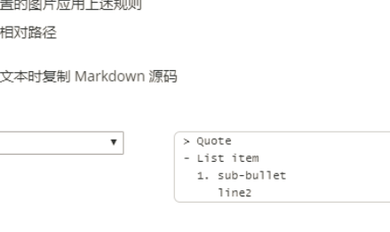

## 用户命令

添加用户

```
useradd 选项 user1
```

删除用户

```
userdel 选项 user1
```

修改用户

```
usermod 选项 user1
```

修改用户密码

```
passwd 选项 user1
```

修改用户密码

```
passwd 选项 user1
```

添加用户组

```
groupadd 选项 group1
```

删除用户组

```
groupdel group1
```

修改用户组

```
groupmod 选项 group1
```


### 1.Linux用户与组


1. root用户  超级管理员


2.系统用户


3.用户组


### 2.权限构成


1.Linux权限构成


### 3.文件与文件夹权限


文件权限与文件夹权限不同

1.文件权限


文件类型：d 表示是目录即文件夹     - 表示是文件

3.修改文件权限


3.1创建一个文件，查看文件的权限


3.2为该文件添加 组和其他用户的写权限


3.3为该文件设置 组和其他用户 只有写权限


4.修改文件的属主


5.修改文件的属组


修改testfile文件的属组

查看已有的用户组


### 4.特殊权限


1.SUID


2.SGID


使用方式和SUID一样

3.SBIT


4.如何设置SUID、SGID、SBIT


