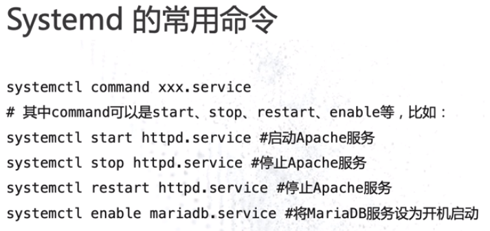
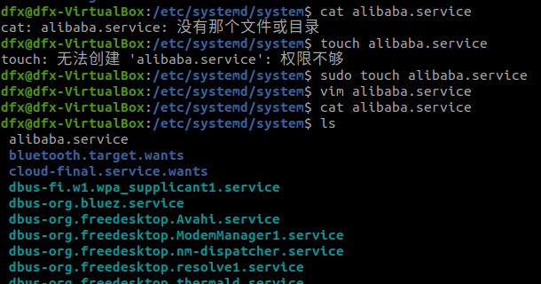
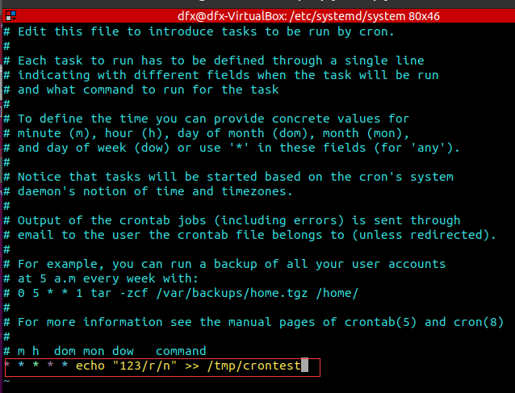

#### 1.Linux下的系统进程

##### 1.1 init进程的职责

Systemd常用

##### 2.Systemd

systemctl status  服务名    查看服务的当前状态

1.查看sshd.service里的内容

2.写一个alibaba.service

[Unit]
Description=Write Something
Wants=network-online.target
After=network.target
[Service]
Type=oneshot
RemainAfterExit=yes
ExecStart=touch /tmp/testfile
ExecStop=rm -f /tmp/testfile
[Install]
WantedBy=multi-user.target

##### 3.crontab定时任务

1.查看当前日程表

2.编辑一个日程表

##### 4.Supervisor

